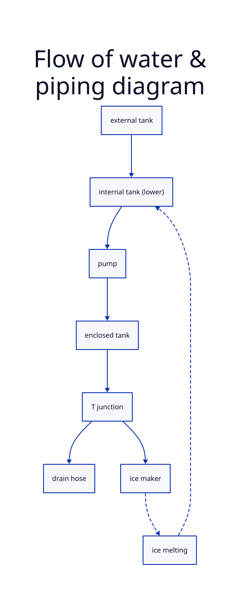

# GE-Opal-2-fixes
This repository documents, all my attempts to make the GE Opal 2 not kill itself
(More specifically, the *GE Profile:tm: Opal:tm: 2.0 Ultra Nugget Ice Maker )

Important context to a lot of frustration here: This is a $500 dollar ice machine. It has a lifespan of 6 months to 1 year

> [!WARNING]  
> Schematics and code are not final or tested yet.

## Notice

As I was writing this, Reddit decided to delete the 2 year old post I was using as a reference.
Some of the more important images are available in ./images
https://web.archive.org/web/20250804095737/https://www.reddit.com/r/IceChewersAnonymous/comments/1hxlbkg/fixing_the_opal_20/

## The Problem

The GE Opal ice maker has well-known issues where it will start to fail after about a year of use, and in some cases, prior.
The machine is incredibly high maintenance, [with GE recommending running bleach through the machine](https://products.geappliances.com/appliance/gea-support-search-content?contentId=000060634) ([archive.org capture](https://web.archive.org/web/20260716162758/https://products.geappliances.com/appliance/gea-support-search-content?contentId=000060634))

There is even (as of writing) [an ongoing class action](https://classlawdc.com/2026/01/21/ge-profile-opalnugget-ice-maker-series-1-0-and-2-0-defective-product-investigation/)

These machines do not fail gracefully, often making screeching and whining noises due to the internal parts getting frozen and locked up. This commonly involves the destruction of the gearbox, auger, and/or bearings.

Browsing Reddit reveals many owners have constant issues with these machines, with one redditor even claiming to go through 4 machines in 2 years. Despite its flaws, this machine is well liked by r/IceChewersAnonymous, though they also agree that it has significant longevity issues. [A quick search shows the love/hate the community has for it.](https://www.reddit.com/r/IceChewersAnonymous/search/?q=opal+2)

More importantly, several members of the community have taken attempts to repair the machine pretty far.
- https://www.reddit.com/r/IceChewersAnonymous/comments/1ophadu/opal_20_repair_update/
- https://www.reddit.com/r/IceChewersAnonymous/comments/1hxlbkg/fixing_the_opal_20/
- https://www.reddit.com/r/IceChewersAnonymous/comments/159ts6e/ge_opal_20_add_water_fix/

# Piping

