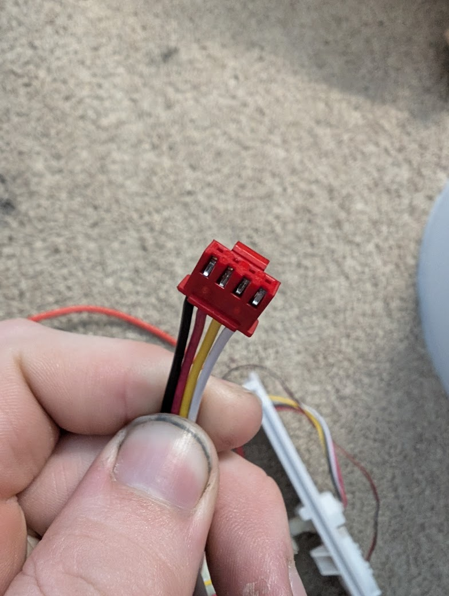

# Nominal voltages recorded from the opal 2 ice maker during operation

- UV Light connector: 12V DC
- Compressor: 120V AC
- Main motor for Auger: 120V AC (Sticker says 15W, 0.48A)
- Pump: 12V DC
- Fan: 12V DC
- WiFi board: TBD (digital?)
- Front panel: TBD (digital?)
- Ice box LED: 12V DC
- Ice box inserted switch: 5V (Inserted = closed circuit)
- Bin capacity sensor
  - IR Tx: 5V DC
  - IR Rx: TBD
- Internal Tank Floats (4 wires, 2 floats)
  - Voltage: 5V DC
  - Black & Red: Lower float (float low = closed circuit)
  - Yellow & White: Upper float (float high = closed circuit)

